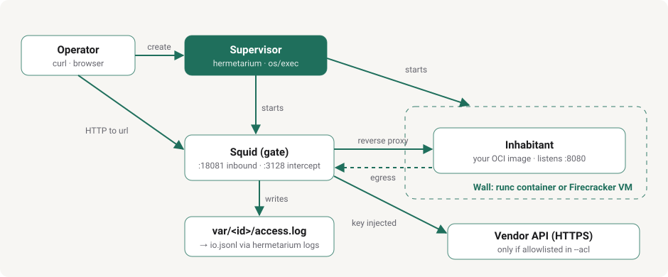

# Hermetarium

[](https://github.com/pihme/hermetarium/actions/workflows/ci.yml)
[](https://github.com/pihme/hermetarium/releases?q=hermetarium)
[](https://github.com/pihme/hermetarium/releases?q=porter)
[](LICENSE)
[](https://pihme.github.io/hermetarium/)

An agent that can run a shell and install packages should not run on the operator's machine. Hermetarium is the world the agent wakes up in: an **inhabitant** boots inside an OCI image and may use its Linux freely (shell, package managers, rewriting files), as root. It is not a per-command sandbox and not a tool the agent calls.

The **wall** is outside the image. A Go **supervisor** boots the image behind either a weak (Docker/`runc`) or strong (Firecracker microVM) wall, starts **Squid** as the only network path with an operator-supplied ACL, and turns Squid's access log into an I/O log. If that path cannot be applied, the habitat does not start (fail closed). API keys never live in the image; Squid injects them from the host-side ACL.

The CLI name is `hermetarium` in full; do not shorten to `herm`.

- [Website](https://pihme.github.io/hermetarium/) — handbook and current status
- [Specification](SPEC.md) — product spec
- [Usage guide](USAGE.md) — walls, Squid, logs, custom images, porter
- [Contributing](CONTRIBUTING.md) — tests, commits, versions; issues welcome, outside pull requests not accepted for now

## Getting started

Needs Docker and Go 1.24+ on `PATH`. The strong wall also needs `/dev/kvm` and **x86_64**. First strong `create` or `make test` fetches Firecracker into the cache dir. Firecracker runs in a privileged helper container; no host `sudo`.

Firecracker helper scripts are embedded. Squid is a pulled image. `create` needs `--acl FILE` (for example `examples/echo/squid.conf` or `inhabitants/claude-code/squid.conf`).

**From source**

```bash
git clone https://github.com/pihme/hermetarium.git
cd hermetarium
make build
./bin/hermetarium version
```

**From a release** (linux-amd64): [hermetarium releases](https://github.com/pihme/hermetarium/releases?q=hermetarium) and [porter releases](https://github.com/pihme/hermetarium/releases?q=porter). Download `hermetarium-linux-amd64`, `chmod +x`, and pass `--acl` a Squid config from the habitat you are running. Porter is copied into inhabitant images, not run next to the supervisor.

`hermetarium version` and `porter version` print semver (`dev` on a local `make build`). GitHub Releases attach linux-amd64 binaries; tags are `hermetarium/vX.Y.Z` and `porter/vX.Y.Z`. Go import path: `github.com/pihme/hermetarium`.

**Hello world**

```bash
make test
```

```bash
make build
id=$(./bin/hermetarium create --wall weak --image myorg/box:1 --acl examples/echo/squid.conf)
./bin/hermetarium url "$id"
curl -sS -d 'hello' "$(./bin/hermetarium url "$id")"
./bin/hermetarium logs "$id"
./bin/hermetarium destroy "$id"
```

`--image` is any local or pullable OCI image that listens on TCP 8080 (`myorg/box:1` and `myorg/claude:dev` below are placeholders for your own images). `url` is the host HTTP address that reaches it **through Squid**. `create --wall strong` works the same. More: [usage guide](USAGE.md).

**An official CLI as inhabitant**

```bash
sed 's/__VENDOR_KEY__/sk-ant-.../' inhabitants/claude-code/squid.conf > /tmp/claude.acl
id=$(./bin/hermetarium create --wall weak --image myorg/claude:dev --acl /tmp/claude.acl)
curl -sS -d 'Run id -u' "$(./bin/hermetarium url "$id")"
```

Dummy env in inhabitant images (`ANTHROPIC_API_KEY=not-the-supervisor-key` and the like) only exist so the CLI will start. Squid still replaces `x-api-key` / `Authorization` from the ACL. Boot flags per CLI: [usage guide](USAGE.md).

**CLI**

```text
hermetarium create --wall weak|strong --image NAME --acl FILE
hermetarium url <id>
hermetarium exec <id> -- <cmd>     # weak wall only, not the product path
hermetarium logs <id>
hermetarium destroy <id>
hermetarium version
```

## Architecture



The operator reaches the inhabitant only through Squid (`hermetarium url` prints a `127.0.0.1` port published from the gate). Box HTTP is intercepted to `:3128`; the `--acl` file is expected to deny by default and allowlists and key-injects vendor hosts. Squid's `access.log` lives in the host instance directory.

The **supervisor** (`supervisor/`) is a Go binary. It is the only operator-facing command. It creates a habitat: picks a wall (weak Docker/`runc` or strong Firecracker), copies `--acl` into the instance, starts Squid, publishes a localhost URL into the box, and maps Squid's access log into the I/O log. It talks to Docker, Firecracker, and Squid as processes (`os/exec`), not via their SDKs.

**Squid** is the logged path. The supervisor pulls a public Squid image and mounts the ACL you pass with `--acl`. Squid runs as a sibling (GPLv2 stays in Squid; the supervisor does not link it). Each example and inhabitant ships its wall config next to its Dockerfile.

**I/O log.** `hermetarium logs <id>` syncs Squid's `access.log` into `var/<id>/io.jsonl`: time, direction (`in`/`out`), protocol, destination, port, method, allowed, bytes. Bodies are off.

**Porter** (`porter/`) is a small HTTP adapter that lives *inside* the inhabitant image, not next to the supervisor. It listens on TCP 8080, which is what `hermetarium url` reverse-proxies to. Each operator POST is one CLI turn (`claude`, `grok`, or `dsh`); later POSTs continue the same session for `claude`/`grok` (`--continue`). DeepSeek Harness's `headless` profile has no resume flag, so each `dsh` turn is an independent one-shot task, not a continued session. You can omit porter and serve HTTP on 8080 yourself (the echo example does).

**Inhabitants** (`inhabitants/`) are Dockerfiles for official coding CLIs: Claude Code, Grok Build, DeepSeek Harness. They run as **root**, install the real binary, set dummy boot keys and vendor base URLs, and `CMD` porter. They are templates. Build an image, then `create --image <tag> --acl FILE`. The ACL file is where vendor allowlists and key inject live.

One possible inhabitant from outside this repo is [Fregoli](https://github.com/pihme/fregoli), a self-evolving web app whose own Docker image serves HTTP on 8080 directly (no porter). Its server currently binds `127.0.0.1` only, which likely keeps it unreachable through the wall until [fregoli#1](https://github.com/pihme/fregoli/issues/1) is resolved.

`examples/` is the test stand-in, not the official CLIs above. `examples/echo/` is a tiny HTTP echo. `examples/agentd/` is one small Go tool loop against a mock Messages API so CI can prove walls, keys, and uid 0 without a live model. The mock origin is `tests/vendormock/`. `make test` uses those. Official-CLI chat through a real model is `make test-live`.

## Layout

| Path | Contents |
| --- | --- |
| `supervisor/` | Go supervisor; entry point `supervisor/cmd/hermetarium` |
| `firecracker-helper/` | TAP + Firecracker scripts for the strong wall (embedded in the binary) |
| `porter/` | HTTP → CLI-turn adapter copied into inhabitant images |
| `inhabitants/` | Claude Code, Grok Build, DeepSeek Harness templates (Dockerfile + `squid.conf`) |
| `examples/` | Test stand-ins: `echo` (HTTP echo) and `agentd` (tool loop against a mock API) |
| `tests/` | Integration tests (hello-world, agentd, official-CLI smoke), harness, vendor mock and probe |
| `docs/images/` | Diagrams used in this README and on the website |
| `var/<id>/` | Instance state under the data root (`HERMETARIUM_ROOT`, the checkout, or `~/.local/share/hermetarium`) |

Firecracker assets cache in `.cache/` under the checkout, or `~/.cache/hermetarium` off-tree. Off-tree, instance state is `~/.local/share/hermetarium/var/` unless you set `HERMETARIUM_ROOT`.

## Tests

Two suites. Spec: [specification, section 11](SPEC.md#11-tests).

**Mocked (CI default).** `make test`. No vendor account. Hello-world (both walls, probe, echo) and one agentd example against a mock vendor API. Official-CLI tests only check that `claude` / `grok` / `dsh` are on PATH and porter is up; they do not claim a mock-driven chat session. GitHub Actions job `test` runs this on every push to `main` and on every pull request.

**Live (optional, not a merge gate).** Real CLI to the real vendor. Natural-language “run a command / install something” as root.

```bash
export HERMETARIUM_ANTHROPIC_API_KEY=sk-ant-...
export HERMETARIUM_XAI_API_KEY=xai-...
export HERMETARIUM_DEEPSEEK_API_KEY=sk-...
make test-live
```

Unset keys skip that vendor. `make test-live` is `go test -tags live`. On GitHub: Actions → CI → **Run workflow** only (not push/PR). Repository secrets with those names are exported into the job for the supervisor. They must not appear in logs.

## License

[PolyForm Noncommercial License 1.0.0](LICENSE). Source-available; not OSI Open Source. Commercial use is not granted. Other licenses can be negotiated with the copyright holder.

Squid is a separate GPLv2 program, run as a sibling process, not linked into the supervisor.
